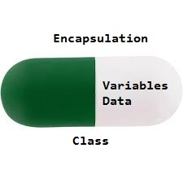

# Assignment-selft-study OOP 12/06/2025

## 1. Encapsulation (การห่อหุ้ม) ในภาษา C#

**Encapsulation** คือการรวมข้อมูล (Fields / Properties) และพฤติกรรม (Methods) ไว้ในหน่วยเดียวคือ **Class**

พร้อมกับการควบคุมการเข้าถึงข้อมูลภายใน class เพื่อให้ **ปลอดภัย** และเป็นไปตามที่เรากำหนดไว้

(หลักการนี้บางครั้งเรียกว่า **Data Hiding**)



```csharp
// ===== Encapsulation ด้วย Auto Properties =====
public class Student
{
    // Auto Properties - สั้นกว่า แต่ควบคุมได้น้อยกว่า
    public string Name { get; set; } = string.Empty;
    public int Age { get; set; }
    
    // Properties with validation
    private double _gpa;
    public double GPA
    {
        get => _gpa;
        set
        {
            // ควบคุมค่า GPA ให้อยู่ระหว่าง 0.00 - 4.00
            if (value >= 0.00 && value <= 4.00)
                _gpa = value;
            else
                Console.WriteLine("❌ GPA ต้องอยู่ระหว่าง 0.00 - 4.00");
        }
    }
    
    // Init-only property - กำหนดได้แค่ตอนสร้าง object
    public string StudentId { get; init; } = string.Empty;
    
    // Computed property - คำนวณจาก properties อื่น
    public string Status
    {
        get
        {
            return _gpa switch
            {
                >= 3.50 => "เกียรตินิยม",
                >= 3.00 => "ดี",
                >= 2.50 => "ปานกลาง",
                >= 2.00 => "พอใช้",
                _ => "ต้องปรับปรุง"
            };
        }
    }
    
    public void ShowStudentInfo()
    {
        Console.WriteLine($"👨‍🎓 นักเรียน: {Name} (รหัส: {StudentId})");
        Console.WriteLine($"   อายุ: {Age} ปี");
        Console.WriteLine($"   เกรด: {GPA:F2} ({Status})");
    }
}
```

## 2. Inheritance (การสืบทอด) ในภาษา C#

**Inheritance (การสืบทอด)** คือกลไกที่อนุญาตให้ **คลาสลูก (Derived Class)** สามารถ **นำคุณสมบัติ (Attributes)** และ **พฤติกรรม (Methods)** จาก **คลาสแม่ (Base Class)** มาใช้ได้

ถือเป็นหนึ่งใน **แกนหลักของ OOP** ที่ช่วยให้:

- ลดการเขียนโค้ดซ้ำ
- แยกความรับผิดชอบเป็นลำดับชั้น
- เพิ่มความสามารถในการดูแลระบบ


```csharp
using System;

// Base class (คลาสแม่)
public class Animal
{
    protected string name;
    
    public Animal(string name)
    {
        this.name = name;
    }
    
    public virtual void MakeSound()
    {
        Console.WriteLine($"{name} makes a sound");
    }
}

// Derived class (คลาสลูก)
public class Dog : Animal
{
    public Dog(string name) : base(name) { }
    
    public override void MakeSound()
    {
        Console.WriteLine($"{name} barks: Woof!");
    }
    
    public void Fetch()
    {
        Console.WriteLine($"{name} fetches the ball");
    }
}

public class Cat : Animal
{
    public Cat(string name) : base(name) { }
    
    public override void MakeSound()
    {
        Console.WriteLine($"{name} meows: Meow!");
    }
}

// Main program
class Program
{
    static void Main()
    {
        Dog dog = new Dog("Buddy");
        Cat cat = new Cat("Whiskers");
        
        dog.MakeSound();  // Buddy barks: Woof!
        dog.Fetch();      // Buddy fetches the ball
        
        cat.MakeSound();  // Whiskers meows: Meow!
        
        // Polymorphism
        Animal[] animals = { dog, cat };
        foreach (Animal animal in animals)
        {
            animal.MakeSound();
        }
    }
}
```

## 3. Abstraction (การแยกส่วน) ในภาษา C#


**Abstraction (การแยกส่วน)** เป็นหลักการของ **Object-Oriented Programming (OOP)** ที่มุ่งเน้นการ **ซ่อนรายละเอียดการทำงานที่ซับซ้อน** ของระบบ และเปิดเผยเฉพาะสิ่งที่จำเป็นให้ผู้ใช้งานเท่านั้น

ในภาษา **C#**, เราสามารถสร้าง abstraction ได้โดยใช้:

- `abstract class` (คลาสนามธรรม)
- `interface` (อินเทอร์เฟซ)

สิ่งเหล่านี้ช่วยให้โฟกัสไปที่ “**object ทำอะไรได้**” (What it does) แทนที่จะสนใจว่า “**ทำงานอย่างไร**” (How it does it)

```csharp
interface IPaymentMethod
{
    void Pay(decimal amount);
}
class CreditCardPayment : IPaymentMethod
{
    public void Pay(decimal amount)
    {
        Console.WriteLine($"Paid {amount:C} using Credit Card.");
    }
}

class PromptPayPayment : IPaymentMethod
{
    public void Pay(decimal amount)
    {
        Console.WriteLine($"Paid {amount:C} using PromptPay.");
    }
}
class PaymentProcessor
{
    private IPaymentMethod paymentMethod;

    public PaymentProcessor(IPaymentMethod method)
    {
        paymentMethod = method;
    }

    public void ProcessPayment(decimal amount)
    {
        paymentMethod.Pay(amount);
    }
}
class Program
{
    static void Main(string[] args)
    {
        IPaymentMethod creditCard = new CreditCardPayment();
        IPaymentMethod promptPay = new PromptPayPayment();

        PaymentProcessor processor1 = new PaymentProcessor(creditCard);
        processor1.ProcessPayment(1000.00m); // Output: Paid ฿1,000.00 using Credit Card.

        PaymentProcessor processor2 = new PaymentProcessor(promptPay);
        processor2.ProcessPayment(500.00m);  // Output: Paid ฿500.00 using PromptPay.
    }
}

```

## 🤔สิ่งที่เกิดขึ้นคือ

- ผู้ใช้ไม่ต้องรู้ว่าแต่ละการจ่ายเงินทำงานภายในอย่างไร
- คุณสามารถเพิ่มช่องทางการชำระเงินใหม่ได้ เช่น QR Code, e-Wallet โดยไม่ต้องแก้ logic เดิม
- แก้ไขหรือเปลี่ยนเบื้องหลังได้โดยไม่กระทบกับการเรียกใช้งาน

## 4. Polymorphism (การมีหลายรูปแบบ) ในภาษา C#


**Polymorphism** คือแนวคิดที่ให้ **วัตถุหลายชนิด** (object จากคนละคลาส) สามารถ **ปฏิบัติตัวในลักษณะเดียวกันได้** หากพวกมันมีพื้นฐานมาจาก **superclass หรือ interface เดียวกัน**

ในภาษา **C#**, Polymorphism ทำได้ผ่าน:

- การใช้ `virtual` และ `override`
- การอ้างอิง object ผ่าน `base class` หรือ `interface`

> ✅ ทำให้เราเขียนโค้ดโดยยึดกับรูปแบบ (interface) เดียว แต่ทำงานต่างกันตามชนิด object จริง
> 

```csharp
class Animal
{
    public virtual void Speak()
    {
        Console.WriteLine("Some animal sound");
    }
}

class Dog : Animal
{
    public override void Speak()
    {
        Console.WriteLine("Woof!");
    }
}

class Cat : Animal
{
    public override void Speak()
    {
        Console.WriteLine("Meow!");
    }
}

class Program
{
    static void Main(string[] args)
    {
        Animal myAnimal;

        myAnimal = new Dog();
        myAnimal.Speak();  // Output: Woof!

        myAnimal = new Cat();
        myAnimal.Speak();  // Output: Meow!
    }
}

```

แม้ว่า `myAnimal` จะถูกประกาศเป็น `Animal` แต่เมื่อ assign เป็น `Dog` หรือ `Cat` แล้วเรียก `Speak()` มันจะแสดงพฤติกรรมตาม class จริงที่ถูกสร้างมา